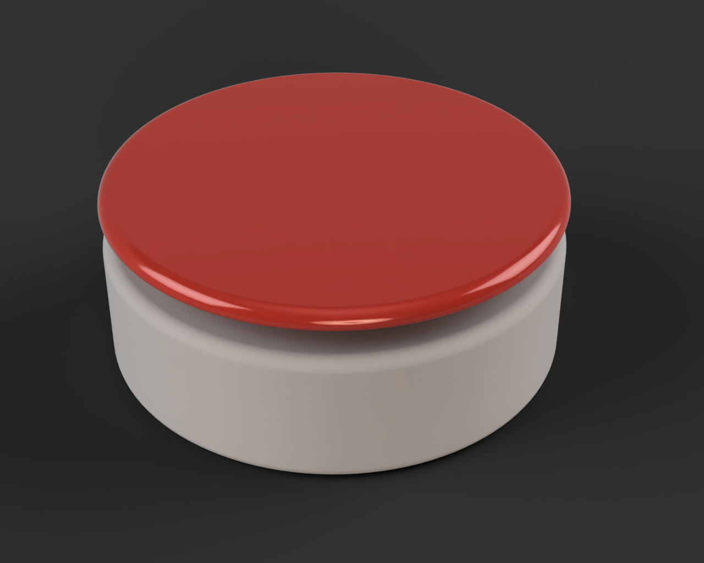
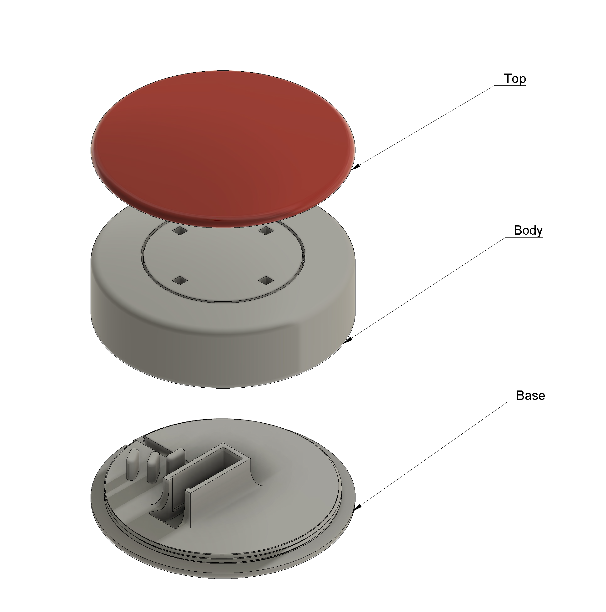

# Adaptive Button

This adaptive button is a 3D-printed accessibility switch designed for use with adapted toys and assistive technology. It is intended to be easy to press for children and individuals who may have difficulty operating small or stiff buttons. The button is made up of three printed parts that assemble without tools (beyond an optional dab of glue) and a standard off-the-shelf switch. The design is open and easy to customize, reprint, or repair.

Key Features

- Large top surface, easy to press from any point
- Living hinge mechanism in the body transmits force to the switch reliably
- Three-part modular design, easy to print, assemble, and service
- Compatible with standard 3.5 mm mono jack wiring for adaptive toy switches
- No supports required on most printers

---

### Parts Overview

The button consists of three 3D-printed components and one electronic switch. Each part is described below.

#### Top (top.stl)

The large dome-shaped pressing surface. Snaps onto the body and can be glued permanently. Can be printed in any color.

#### Body (body.stl)

The main structural piece. Contains a living hinge mechanism that flexes when the top is pressed, depressing the switch below. **MUST** be printed in PETG for flexibility-- PLA is too brittle and will snap.

#### Base (base.stl)

The bottom plate. Houses the switch and wiring. Screws onto the body. Can be printed in PLA or PETG.

#### Switch

An off-the-shelf momentary switch. Mounted in the base.

---

### Print Settings

**Top:** PLA or PETG 20%+ 0.2 mm

**Body:** PETG only 20% 0.2 mm *Ironing of surface below hinge piece recommended-- use modifier shapes in your preferred slicer*

**Base:** PLA or PETG 20%+ 0.2 mm
